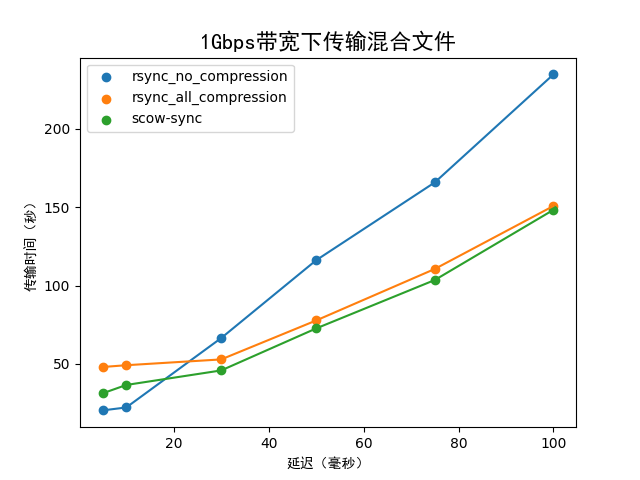

# Scow-Sync

A file transfer system tool on SCOW

## Install

### from source code

Clone the repository in a directory that sudoer have access to, then execute`sudo bash install.sh`. 

## Config

You can edit the `scow_sync/config.py` to configure the default path. 

Edit the `SHEBANG_PATH` to use the interpreter that you want. If you update the `SHEBANG_PATH`, you must execute the `sudo bash install.sh update` to update the shebang of scow-sync, scow-sync-query, scow-sync-start, scow-sync-terminate.

You'd better edit the `SCOWSYNC_PATH` with `~/` that each user will have his own directory.

### split large files

Scow-sync will split large files automatically, and then open several TCP connections concurrently to improve transmission performance.

You can edit the `SPLIT_THRESHOLD` and the `SPLIT_CHUNK_SIZE` in the `config.py`

## Start

### background

You can use the following command for transfer, but the command will return immediately. That is, it starts a transfer in the background. If you first execute the command, it will create the directory `SCOWSYNC_PATH`, file `LOG_PATH` and file `ERROR_PATH` to store the transfer information including the transferring log and error log. You can configure these paths in the `config.py`.

```bash
scow-sync-start [-h] [-a ADDRESS] [-u USER] [-s SOURCE] [-d DESTINATION] [-p PORT] [-k SSHKEY_PATH]
```

Optional arguments:

  `-h, --help`  show help message and exit

  `-a ADDRESS, --address ADDRESS` address of the server

  `-u USER, --user USER`  username for logging in to the server

  `-s SOURCE, --source SOURCE`  path to the source file or directory

  `-d DESTINATION, --destination DESTINATION` path to the destination directory
  
  `-p PORT, --port PORT`  port of the server

  `-k SSHKEY_PATH, --sshkey_path PATH`  path of private key

  `-c, --check` check whether the private key is right and return true or false

Attention: 

1. If you want to use the `-c, --check` parameter, please make sure that the key verification on the remote machine has a higher priority than password authentication.
   
2. In fact, the `scow-sync-start` command will create a directory which is named by the **Transfer Id** of this time to store the infomation include progress, speed and so on. You can use the `scow-sync-query` command to view the transfer information.

#### frontground

Just replace the `scow-sync-start` command with `scow-sync`. It will print the message of log and error on shell.

## Query

You can use the following command to view the real-time transfer process.

```bash
scow-sync-query
```

It will return an array of json object like:

```yaml
[{
  "recvAddress": recv_address, 
  "filePath": file_path, 
  "transferSize": transfer_size,
  "progress": progress, 
  "speed": speed, 
  "leftTime": time,
}...]
```

## Terminate

You can use the following command to terminate the transfer process. But you should note that the shutdown of the process is at the granularity of the rsync service. It will then restart the rsync service but with `--exclude` to exclude the files that have been terminated.

```bash
scow-sync-terminate [-h] [-a ADDRESS] [-u USER] [-s SOURCE] [-p PORT] [-k SSHKEY_PATH]
```

Optional arguments:

  `-h, --help`  show this help message and exit

  `-a ADDRESS, --address ADDRESS` address of the server

  `-u USER, --user USER`  username for logging in to the server

  `-s SOURCE, --source SOURCE`  path to the source file or directory

## Performance

### parallel

The bandwidth of the network environment is 100Mbps, and the delay is 50ms.

The size of each file is 20MB in multiple files.


### dynamic compress

The test data has a total of 20 files of 100MB in size, of which "files hard compressed"(high degree of disorder, compression can reduce the volume by 25%) and "files easily compressed" (with less disorder, compression can reduce volume by 90%) are both half of the files.


