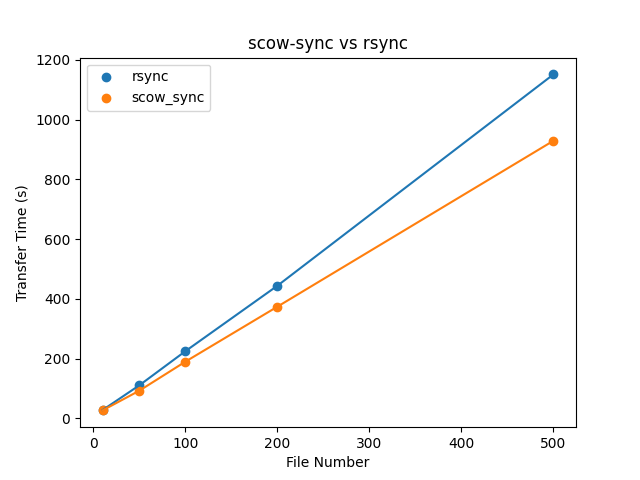

# Scow-Sync
A file transfer system tool on SCOW

## Install

### dependencies

- python > 3.6
 
- pip3

- paramiko 3.0.0

- psutil 5.9.4 

- rsync >= 3.1.0

### install globally

Clone the repository in a directory that sudoer have access to, then execute`sudo bash install.sh`. 

## Usage

### config

You can edit the `config.py` to configure the default path. 

Edit the `SHEBANG_PATH` to use the interpreter that you want. If you update the `SHEBANG_PATH`, you must execute the `sudo bash install.sh update` to update the shebang of scow-sync, scow-sync-query, scow-sync-start, scow-sync-terminate.

You'd better edit the `SCOWSYNC_PATH` with `~/` that each user will have his own directory.

### start

#### background

You can use the following command for transfer, but the command will return immediately. That is, it starts a transfer in the background. If you first execute the command, it will create the directory `SCOWSYNC_PATH`, file `LOG_PATH` and file `ERROR_PATH` to store the transfer information including the transferring log and error log. You can configure these paths in the `config.py`.

```bash
scow-sync-start [-h] [-a ADDRESS] [-u USER] [-s SOURCE] [-d DESTINATION] [-p PORT] [-k SSHKEY_PATH]
```

Optional arguments:

  `-h, --help`  show help message and exit

  `-a ADDRESS, --address ADDRESS` address of the server

  `-u USER, --user USER`  username for logging in to the server

  `-s SOURCE, --source SOURCE`  path to the source file or directory

  `-d DESTINATION, --destination DESTINATION` path to the destination directory
  
  `-p PORT, --port PORT`  port of the server

  `-k SSHKEY_PATH, --sshkey_path PATH`  path of private key

  `-c, --check` check whether the private key is right and return true or false

Attention: 

1. If you want to use the `-c, --check` parameter, please make sure that the key verification on the remote machine has a higher priority than password authentication.
   
2. In fact, the `scow-sync-start` command will create a directory which is named by the **Transfer Id** of this time to store the infomation include progress, speed and so on. You can use the `scow-sync-query` command to view the transfer information.

#### frontground

Just replace the `scow-sync-start` command with `scow-sync`. It will also store the transferring infomation in `SCOWSYNC_PATH`.

### query

You can use the following command to view the real-time transfer process.

```bash
scow-sync-query
```

It will return an array of json object like:

```yaml
[{
  "recvAddress": recv_address, 
  "filePath": file_path, 
  "transferSize": transfer_size,
  "progress": progress, 
  "speed": speed, 
  "leftTime": time,
}...]
```

### terminate

You can use the following command to terminate the transfer process. But you should note that the shutdown of the process is at the granularity of the rsync service. 

For example, you are using an rsync service to transfer a folder dir, which consists of file1 and file2. When using `-s --source` as the parameter to terminate the transmission with `-s dir/file1`, it actually closes the transmission of the entire folder dir, which is equivalent to `-s dir`.

To prevent this from happening, please increase `-m --max-depth` when starting `scow-sync-start` transmission to increase the parallel granularity.

```bash
scow-sync-terminate [-h] [-a ADDRESS] [-u USER] [-s SOURCE] [-p PORT] [-k SSHKEY_PATH]
```

Optional arguments:

  `-h, --help`  show this help message and exit

  `-a ADDRESS, --address ADDRESS` address of the server

  `-u USER, --user USER`  username for logging in to the server

  `-s SOURCE, --source SOURCE`  path to the source file or directory


## Performance

Through the WANem wide area network simulator, the simulated test environment has a bandwidth of **100Mbps** and a delay of **50ms**.

Through the `dd` command, randomly generate many files with a size of 20MB from `/dev/urandom`. Compare the time it takes rsync and scow-sync to transfer different numbers of files.



  